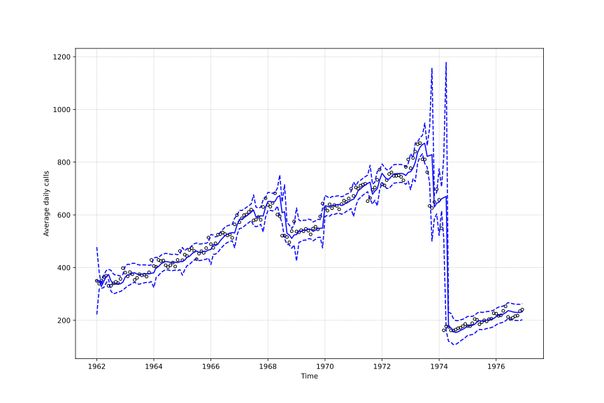
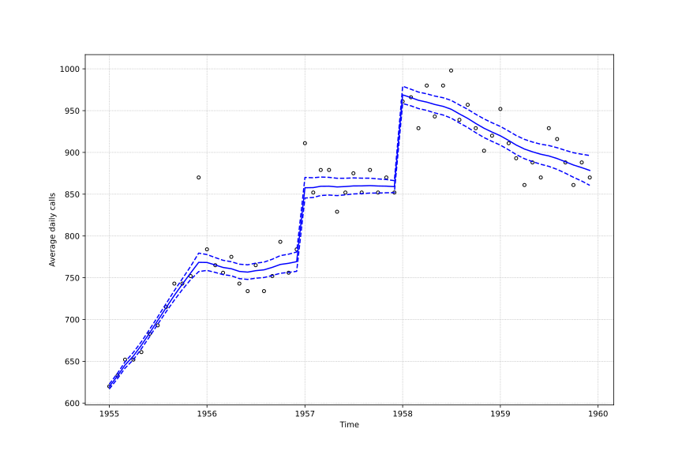

<!-- README.md is generated from README.Rmd. Please edit that file -->

## `pybats-detection`

> The `pybats-detection` is a `python` package with routines for
> detection of outlier and structural changes in time series using
> Bayesian Dynamic Linear Models. The currently version of the package
> implements the automatic monitoring, manual intervention and
> smoothing.

## Installation

The development version can be installed from
[GitHub](https://github.com/) using:

``` bash
$ git clone git@github.com:Murabei-OpenSource-Codes/pybats-detection.git pybats-detection
$ cd pybats-detection
$ sudo python setup.py install
```

## Quick overview

The package uses the `pybats.dglm.dlm` objects from
[`pybats`](https://github.com/lavinei/pybats) as input of the following
classes:

-   `AutomaticMonitoring`: perform automatic monitoring of outlier
    and/or structural changes in time series according to [West and
    Harisson (1986)](https://www.tandfonline.com/doi/abs/10.1080/01621459.1986.10478331)
    .

-   `ManualIntervention`: perform manual intervention of outlier and/or
    structural changes in time series according to [West and
    Harrison (1989)](https://onlinelibrary.wiley.com/doi/abs/10.1002/for.3980080104).

-   `Smoothing`: compute the retrospective state parameters and
    predictive distribution.

All three classes have the `fit` method which received the univariate
time series as a `pandas.Series` object and further arguments related to
each class.

### Example of Monitoring

``` python
>>> import numpy as np
>>> import pandas as pd
>>> import matplotlib.pyplot as plt
>>> from pybats.dglm import dlm
>>> from matplotlib.pyplot import figure
>>> from pybats_detection.loader import load_cp6
>>> from pybats_detection.monitor import AutomaticMonitoring
>>> from pybats_detection.loader import load_telephone_calls
>>> from pybats_detection.intervention import ManualIntervention
>>> 
>>> # Load data
>>> telephone_calls = load_telephone_calls()
>>> 
>>> # Defining the model
>>> a = np.array([350, 0])
>>> R = np.eye(2)
>>> np.fill_diagonal(R, val=[100])
>>> mod = dlm(a, R, ntrend=2, deltrend=0.95)
>>> 
>>> # Fitting with the automatic monitoring
>>> monitor = AutomaticMonitoring(mod=mod, bilateral=True, prior_length=20)
>>> fit_monitor = monitor.fit(y=telephone_calls["average_daily_calls"], h=4,
>>>                           tau=0.135, change_var=[10, 2])
```

    ## Upper potential outlier detected at time 24 with H=0.006182801077763127, L=0.006182801077763127and l=1
    ## Upper potential outlier detected at time 36 with H=0.04695009275309578, L=0.04695009275309578and l=1
    ## Upper potential outlier detected at time 48 with H=0.010667111715486855, L=0.010667111715486855and l=1
    ## Upper parametric change detected at time 61 with H=371.5075065279889, L=0.8665659319590896 and l=3
    ## Lower parametric change detected at time 69 with H=73.48957980292538, L=21.11336373558922 and l=3
    ## Upper parametric change detected at time 73 with H=1017.8894222937022, L=5.103069050925839 and l=3
    ## Lower potential outlier detected at time 77 with H=0.0004773719349100128, L=0.0004773719349100128and l=1
    ## Lower potential outlier detected at time 79 with H=8.290756920919369e-05, L=8.290756920919369e-05and l=1
    ## Upper potential outlier detected at time 84 with H=0.05878813134403288, L=0.05878813134403288and l=1
    ## Upper potential outlier detected at time 95 with H=0.06892996628785275, L=0.06892996628785275and l=1
    ## Upper potential outlier detected at time 108 with H=0.07266554972703385, L=0.07266554972703385and l=1
    ## Lower potential outlier detected at time 115 with H=0.00012539263264369665, L=0.00012539263264369665and l=1
    ## Lower parametric change detected at time 121 with H=9.817545249668383, L=9.817545249668383 and l=3
    ## Upper potential outlier detected at time 132 with H=0.028683109480204753, L=0.028683109480204753and l=1
    ## Upper parametric change detected at time 137 with H=1.3781426241191645, L=0.014890903913373155 and l=3
    ## Lower potential outlier detected at time 138 with H=0.009474041226003621, L=0.009474041226003621and l=1
    ## Lower potential outlier detected at time 140 with H=0.028300819384206272, L=0.028300819384206272and l=1
    ## Lower potential outlier detected at time 141 with H=0.0015973993973896503, L=0.0015973993973896503and l=1
    ## Upper potential outlier detected at time 144 with H=0.11437026489167935, L=0.11437026489167935and l=1
    ## Lower potential outlier detected at time 146 with H=9.965912212293438e-06, L=9.965912212293438e-06and l=1
    ## Lower potential outlier detected at time 147 with H=1.3965093239872577e-08, L=1.3965093239872577e-08and l=1

``` python
>>> dict_filter = fit_monitor.get("filter")
>>> dict_filter.keys()
```

    ## dict_keys(['predictive', 'posterior'])

``` python
>>> data_predictive = dict_filter.get("predictive")
>>> data_predictive.head()
```

    ##    t  prior    y           f  ...  l_upper  what_detected    ci_lower    ci_upper
    ## 0  1   True  350  350.000000  ...        1        nothing  222.304223  477.695777
    ## 1  2   True  339  350.000000  ...        1        nothing  318.483933  381.516067
    ## 2  3   True  351  328.311860  ...        1        nothing  321.629479  334.994242
    ## 3  4   True  364  348.024290  ...        1        nothing  324.103892  371.944688
    ## 4  5   True  369  365.042878  ...        1        nothing  341.620552  388.465204
    ## 
    ## [5 rows x 16 columns]

``` python
>>> figure(figsize=(12, 8))
>>> plt.plot(telephone_calls["time"], telephone_calls["average_daily_calls"], "o",
>>>          markersize=4, color="black", fillstyle="none")
>>> # plt.plot(df_fit["f"], color="red")
>>> plt.plot(telephone_calls["time"], data_predictive["f"], color="blue")
>>> plt.plot(telephone_calls["time"], data_predictive["ci_lower"], color="blue",
>>>          linestyle="dashed")
>>> plt.plot(telephone_calls["time"], data_predictive["ci_upper"], color="blue",
>>>          linestyle="dashed")
>>> plt.grid(linestyle="dotted")
>>> plt.xlabel("Time")
>>> plt.ylabel("Average daily calls")
>>> plt.show()
```



### Example of Intervention

``` python
>>> # Load data
>>> cp6 = load_cp6()
>>> 
>>> # Defining the model
>>> a = np.array([600, 1])
>>> R = np.array([[100, 0], [0, 25]])
>>> mod = dlm(a, R, ntrend=2, deltrend=[0.90, 0.98])
>>> 
>>> # Specifying the interventions
>>> list_interventions = [
>>>     {"time_index": 12, "which": ["variance", "noise"],
>>>      "parameters": [{"v_shift": "ignore"},
>>>                     {"h_shift": np.array([0, 0]),
>>>                      "H_shift": np.array([[1000, 25], [25, 25]])}]
>>>      },
>>>     {"time_index": 25, "which": ["noise", "variance"],
>>>      "parameters": [{"h_shift": np.array([80, 0]),
>>>                      "H_shift": np.array([[100, 0], [0, 0]])},
>>>                     {"v_shift": "ignore"}]},
>>>     {"time_index": 37, "which": ["subjective"],
>>>      "parameters": [{"a_star": np.array([970, 0]),
>>>                      "R_star": np.array([[50, 0], [0, 5]])}]}
>>> ]
>>> 
>>> # Fitting with the interventions
>>> manual_interventions = ManualIntervention(mod=mod)
>>> out_int = manual_interventions.fit(
>>>     y=cp6["sales"], interventions=list_interventions)
>>> dict_smooth = out_int.get("smooth")
>>> data_posterior = dict_smooth.get("posterior")
>>> data_level = data_posterior[data_posterior["parameter"] == "theta_1"].copy()
>>> data_level.head()
```

    ##   parameter        mean  variance  t    ci_lower    ci_upper
    ## 0   theta_1  619.752270  2.150703  1  616.819767  622.684773
    ## 1   theta_1  632.628586  2.620157  2  629.391816  635.865356
    ## 2   theta_1  645.582054  3.487580  3  641.847744  649.316364
    ## 3   theta_1  656.292422  4.831934  4  651.896918  660.687927
    ## 4   theta_1  669.266738  4.427634  5  665.059141  673.474334

``` python
>>> figure(figsize=(12, 8))
>>> plt.plot(cp6["time"], cp6["sales"], "o",
>>>          markersize=4, color="black", fillstyle="none")
>>> # plt.plot(df_fit["f"], color="red")
>>> plt.plot(cp6["time"], data_level["mean"], color="blue")
>>> plt.plot(cp6["time"], data_level["ci_lower"], color="blue",
>>>          linestyle="dashed")
>>> plt.plot(cp6["time"], data_level["ci_upper"], color="blue",
>>>          linestyle="dashed")
>>> plt.grid(linestyle="dotted")
>>> plt.xlabel("Time")
>>> plt.ylabel("Average daily calls")
>>> plt.show()
```



## Authors

`pybats-detection` was developed by [André
Menezes](https://andrmenezes.github.io/) and [Eduardo
Gabriel](https://www.linkedin.com/in/eduardo-gabriel-433332142/) while
working as Data Scientist at [Murabei Data
Science](https://www.murabei.com/) advised by [André
Baceti](https://br.linkedin.com/in/andre-baceti/pt) and professor [Hélio
Migon](http://lattes.cnpq.br/7997248190492823).

## License

The `pybats-detection` package is released under the Apache License,
Version 2.0. Please, see file `LICENSE.md`.
